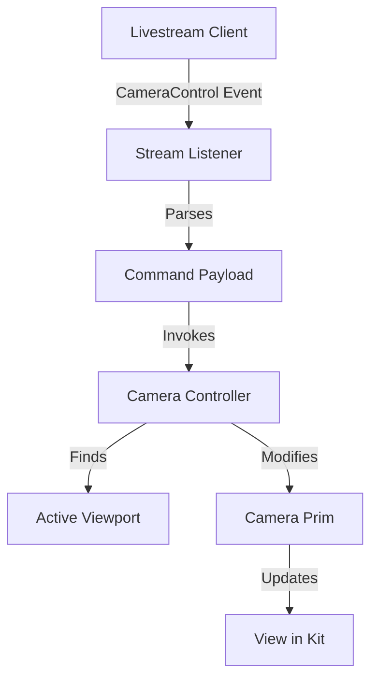

# Architecture: Viewport Control

## High-Level Design

The extension is designed as a focused **Event Listener -> Action** loop.

## Components

### 1. `StreamListener` (`stream_listener.py`)
- **Responsibility**: Subscribes to the livestream message bus.
- **Event**: `CameraControl`
- **Payload**: `{"command": "move_forward", "value": 1.0}`
- **Action**: Validates payload and routes to `CameraController`.

### 2. `CameraController` (`camera_controller.py`)
- **Responsibility**: Abstraction layer for USD camera manipulation.
- **Key Methods**:
    - `move_forward()`, `rotate_left()`: Calculates new transforms.
    - Uses `omni.usd` / `Gf` to apply matrix transformations to the active camera prim.

## Data Flow

1.  **Event Reception**: `StreamListener` receives `{"command": "rotate_left"}`.
2.  **Dispatch**: Calls `CameraController.rotate_left()`.
3.  **Calculation**: Controller gets active camera, computes rotation matrix (local Y axis).
4.  **Update**: Controller applies new world transform to the camera Xform.
